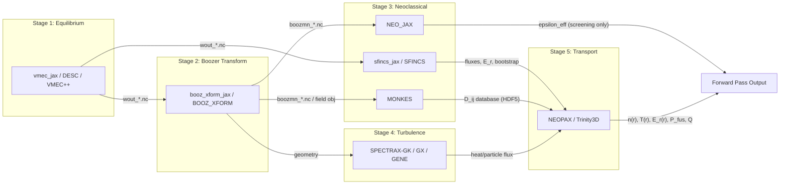

# StellaForge Architecture

## Project Overview

StellaForge implements the stellarator design workflow described in the companion `stellarator_workflow/` submodule as a containerized, orchestrated software pipeline. The physics and I/O contracts are defined in two TeX manuscripts:
- `stellarator_workflow.tex` -- governing equations and code-by-code details
- `stellarator_io_reference.tex` -- input/output contracts and handoff specifications

**Goal:** A working forward pass -- a single traversal of the pipeline from boundary Fourier coefficients and profile guesses through to transport-consistent profiles and fusion-power metrics (P_fus, Q). This is distinct from closing the optimization loop, which would feed updated pressure and current back to the equilibrium stage.

**JAX-first strategy:** The pipeline prioritizes JAX-native implementations for differentiability and tight integration: vmec_jax -> booz_xform_jax -> (NEO_JAX + sfincs_jax + MONKES) -> SPECTRAX-GK -> NEOPAX. Traditional codes (VMEC++, BOOZ_XFORM, NEO, SFINCS, GX, GENE, Trinity3D) will be added as swappable alternatives.

## Pipeline Diagram



Note: Stages 3 and 4 can run in parallel after Stage 2 completes (sfincs_jax can start as soon as Stage 1 completes since it reads wout directly). Within Stage 3, NEO_JAX, sfincs_jax, and MONKES can also run in parallel. NEO_JAX's epsilon_eff output is a screening diagnostic only -- it does NOT feed into NEOPAX or Trinity3D as a transport variable.

## Stage Summary Table

| Stage | Physics | JAX Primary | Alternatives | Input Artifacts | Output Artifacts |
|-------|---------|-------------|--------------|-----------------|------------------|
| 1. Equilibrium | Ideal-MHD force balance: nabla p = J x B | vmec_jax, DESC | VMEC++ | INDATA/JSON boundary coefficients, pressure/iota/current coefficients, PHIEDGE | `wout_*.nc` (NetCDF) |
| 2. Boozer Transform | Coordinate transform to Boozer angles | booz_xform_jax | BOOZ_XFORM | `wout_*.nc` (JAX: Python API; legacy: `in_booz.*` control) | `boozmn_*.nc` (NetCDF) |
| 3. Neoclassical | Effective ripple (NEO), drift-kinetic transport (SFINCS), monoenergetic coefficients (MONKES) | NEO_JAX, sfincs_jax, MONKES | NEO, SFINCS | NEO/MONKES: `boozmn_*.nc`; SFINCS: `wout_*.nc` + input file | `neo_out.*`, `sfincsOutput.h5`, D_ij HDF5 database |
| 4. Turbulence | Delta-f gyrokinetic equation | SPECTRAX-GK | GX, GENE | Geometry + species profiles/gradients | gamma, omega, heat/particle flux (NetCDF/CSV) |
| 5. Transport | 1D conservation laws for n_s, p_s | NEOPAX | Trinity3D | D_ij database + geometry + fluxes | n(r), T(r), E_r(r), P_fus, Q (HDF5/NetCDF) |

## Interface Contract Design

All inter-stage communication is **file-based** using standard physics file formats:
- **NetCDF** (`.nc`): equilibrium (`wout_*.nc`), Boozer (`boozmn_*.nc`), turbulence outputs
- **HDF5** (`.h5`): neoclassical outputs (`sfincsOutput.h5`), MONKES D_ij databases, NEOPAX profiles

There is no wrapper protocol or adapter layer. Snakemake rules define which files connect which stages. Each stage's `spec.md` is the authoritative source for required/optional fields in its output files.

**Output directory convention:** Each stage writes to `{run_dir}/stage{N}_{name}/` on a shared volume mount.

### Two Key Distinctions

From the TeX manuscripts, two distinctions are critical for correct pipeline wiring:

1. **Screening-only outputs vs. transport state variables.** NEO_JAX's epsilon_eff is central to ranking candidate geometries but is NOT advanced by a transport solver. The workflow engineer must not wire it as a transport input.

2. **Dual-role outputs.** Heat/particle flux from GX, GENE, or SPECTRAX-GK, and neoclassical flux from SFINCS, are simultaneously optimization objectives (to minimize) AND direct numerical inputs that the transport stage needs for profile evolution. Their interfaces must be robust machine-readable contracts.

## Container Architecture

StellaForge is a **recipe repo**: it contains everything needed to build and run the containerized pipeline, but does not contain the upstream solver code itself. The upstream codes (vmec_jax, MONKES, etc.) are installed as dependencies during the Docker build.

### Stage-Independent Containers

Each stage has a fully independent, self-contained Dockerfile. There are no shared base images -- each stage manages its own complete dependency stack. This fully decoupled approach means:

- CPU stages use `FROM python:3-slim` (pin to a specific minor version tag in the actual Dockerfile, e.g., `python:3.12-slim`).
- GPU stages use `FROM nvidia/cuda:12.x-runtime` and install JAX[cuda] directly. GPU stages may have less flexibility in Python version due to CUDA/JAX compatibility constraints.
- Each Dockerfile installs its own scientific stack (NumPy, SciPy, h5py, netCDF4, xarray, wandb, etc.) alongside stage-specific upstream code.
- Cross-stage dependency consistency is managed through `versions.yaml` (for JAX and CUDA pins) and integration tests (for output compatibility), not through shared images.

### Container Layout

```
containers/
├── stage1-equilibrium/
│   ├── Dockerfile             # Standalone (FROM python:3-slim)
│   ├── .dockerignore
│   ├── requirements.txt       # vmec_jax @ git+...@SHA, plus all dependencies
│   └── scripts/
│       ├── run.py             # ENTRYPOINT: reads input files, calls vmec_jax, writes wout
│       └── config.py          # Translates pipeline config.yaml -> code-specific config
├── stage2-boozer/
│   └── ...
├── stage4-turbulence/
│   ├── Dockerfile             # Standalone (FROM nvidia/cuda:12.x-runtime)
│   └── ...
└── ...
```

Each `scripts/run.py` is both the container ENTRYPOINT and a locally-runnable script. During Phase 1, stage owners run it locally to test and develop. During Phase 2, it becomes the container entry point.

### Version Pinning

All upstream dependencies are pinned in `versions.yaml` at the repo root:

```yaml
# versions.yaml
jax: "0.4.35"
cuda: "12.4"

stages:
  stage1:
    vmec_jax:
      repo: https://github.com/uwplasma/vmec_jax
      commit: abc123def    # Exact SHA -- not a branch name
    desc:
      repo: https://github.com/PlasmaControl/DESC
      commit: def456abc
  stage2:
    booz_xform_jax:
      repo: https://github.com/uwplasma/booz_xform_jax
      commit: 789xyz012
  # ...
```

**Why this matters:** A Dockerfile that clones `main` of an upstream repo is not reproducible -- `main` changes daily. Pinning to commit SHAs ensures that anyone building the containers 6 months from now gets the exact same code. Stage owners record the working SHA during Phase 1 and update it deliberately when upgrading.

### Publishing

Prebuilt container images are published to **Docker Hub** under the `stellaforge/` organization. Users who just want to run the pipeline can `docker pull` rather than build from source.

### Known Risks

**1. Source-build fragility.** Some upstream codes are not on PyPI and must be built from source (`git clone` + `pip install .`). These builds depend on the upstream repo's build system, which may change. Mitigations: pin commit SHAs, test builds in CI, maintain fallback known-good versions in `versions.yaml`.

**2. Independent dependency drift.** Since each stage manages its own dependency stack, JAX or NumPy version mismatches between stages could cause subtle numerical differences in shared data formats. Mitigation: pin JAX and CUDA versions in `versions.yaml` as a project-wide recommendation; run cross-stage integration tests to catch format or precision mismatches.

**3. Cross-stage version compatibility.** Stage 1 writes `wout_*.nc` using vmec_jax v1.2; Stage 2 reads it using booz_xform_jax built against vmec_jax v1.1. Subtle format differences could cause silent failures. Mitigation: integration tests at every stage boundary (Phase 2); `versions.yaml` provides a single source of truth for compatible version sets.

## Swappability Patterns

The pipeline supports three levels of implementation swapping, all config-driven:

### Single-Stage Swap
Change `config.yaml` to select a different implementation for one stage. The Snakemake rule for the selected implementation fires instead. The output file format must match what downstream stages expect.

Example: Replace SPECTRAX-GK with GX for Stage 4 by setting `stage4.implementation: gx`.

### Multi-Stage Swap
A combined Snakemake rule replaces multiple individual stage rules. The combined rule must produce all the output files that downstream stages expect.

Example: DESC can perform both equilibrium solving and Boozer transformation internally. A single `rule equilibrium_boozer_desc` replaces both Stage 1 and Stage 2 rules.

### End-to-End Swap
The entire pipeline DAG is replaced by a single rule. Useful for an all-in-one Python pipeline or a completely different solver chain.

Example: `rule full_pipeline_jax` replaces stages 1-5 with a monolithic differentiable pipeline.

## Phased Timeline

| Phase | What | Who | Prerequisite |
|-------|------|-----|-------------|
| Phase 1: Document & Run | Get JAX code running, document I/O, API, convergence, create Claude skills, set up W&B tracking | 5 stage owners | Spec docs delivered |
| Phase 2: Containerize & Test | Docker containers, integration tests, output validation | 5 stage owners | Phase 1 complete for your stage |
| Phase 3: Integrate | Snakemake DAG, end-to-end tests, pipeline-level W&B | Workflow engineer | Phase 2 complete for all stages |

## Team Roles

### Stage Owner (5 people, one per stage)

Each stage owner is responsible for their stage end-to-end. See `docs/contributor-guide.md` for the detailed playbook. Key responsibilities:

**Phase 1:** Install and run the primary JAX code, validate the I/O spec, document the API, identify convergence/divergence cases, create Claude skills (dev + operational), set up W&B tracking.

**Phase 2:** Build Docker container, write unit/regression/integration tests, define acceptance criteria.

### Workflow Engineer (1 person)

Responsible for the Snakemake orchestration layer. See `docs/workflow-integration.md` for the detailed spec. Key responsibilities:

**Phase 3:** Design and implement the Snakemake DAG, implement config-driven swappability, build pipeline-level W&B aggregation, write end-to-end integration tests.

### Coordination Points
- Stage 3 and Stage 5 owners must coordinate on the MONKES -> NEOPAX D_ij database handoff (exact HDF5 field names and shapes)
- Stage 4 and Stage 5 owners must coordinate on how SPECTRAX-GK turbulent flux feeds into NEOPAX (NEOPAX has turbulence-coupling utilities but they are not the default path; the public examples center on the neoclassical reduced model from MONKES)
- All stage owners must ensure their container outputs conform to the file formats specified in their stage's `spec.md` before the workflow engineer begins Phase 3

## References

- `stellarator_workflow/stellarator_workflow.tex` -- Governing equations and physics context
- `stellarator_workflow/stellarator_io_reference.tex` -- I/O contracts, handoff tables, objective tables  
- `stellarator_workflow/README.md` -- Mermaid flowchart and code map
- `stellarator_workflow/references.bib` -- Literature references
